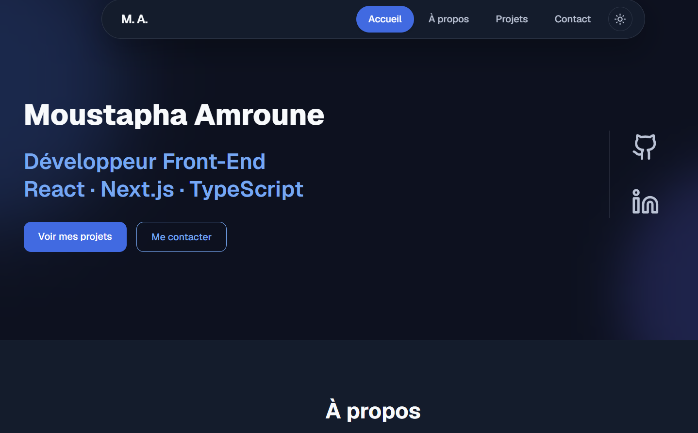

# Portfolio - Moustapha Amroune

Personal portfolio built with Next.js, React and TypeScript.

It presents my front-end profile, technical skills, personal applications and training projects.

**Live site:** https://m-amroune-porfolio.vercel.app/

<p align="center">
  
</p>

---

## About

The portfolio includes my main personal applications, projects completed through OpenClassrooms and FreeCodeCamp, and detailed presentations of selected projects.

The interface is responsive and includes light and dark themes.

---

## Personal Projects

- **Admin Dashboard** - administration interface with authentication, user management and order tracking
- **Job Tracker** - application for tracking job applications and statuses
- **GitHub Resume Generator** - resume-style page generated from a public GitHub profile

Training projects are also available on the dedicated projects page.

---

## Built With


---

## Features

- Responsive one-page homepage
- Light and dark themes
- Active section navigation
- Personal project presentations
- Dedicated projects page
- Contact form with email sending
- Responsive layouts for desktop, tablet and mobile

---

## Local Development

```bash
git clone https://github.com/m-amroune/portfolio.git
cd portfolio
npm install
npm run dev
